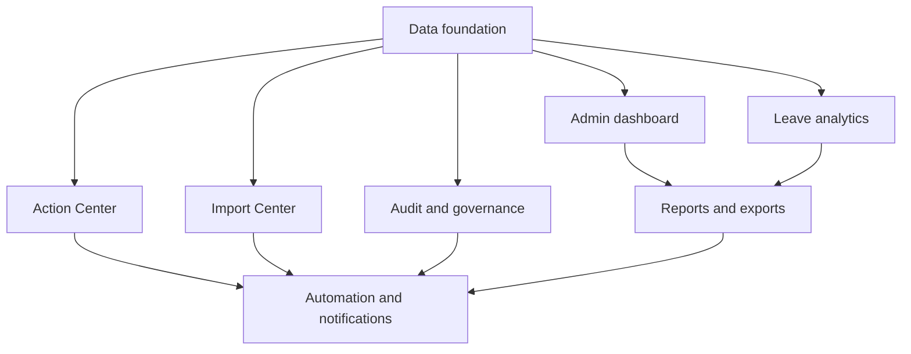

# EduLeave Analytics and Automation Roadmap

## Purpose

This documentation turns the current admin area into a phased, implementation-ready analytics and automation program. It does not replace the working approval and leave-card flows. It adds a shared data foundation, operational visibility, safer imports, repeatable reports, automation, and accountability around them.

## Current project baseline

EduLeave is a Laravel 12/PHP 8.2 application using Blade, Pest, database queues, and an existing Chart.js asset. The admin area already provides authenticated routes for all, pending, approved, and rejected users; teaching/non-teaching leave-card lookup and CRUD; employee detail endpoints; Excel template download and transactional import; and queued approval/rejection mail.

The normalized domain is already a useful foundation:

- `User` owns an `EmployeeProfile`; approval state is stored in `users.status`.
- `EmployeeProfile` owns a `PersonnelType` and routes records to either `TeachingLeaveCard` or `NonTeachingLeaveCard`.
- Teaching records already cast credited, paid, balance, and unpaid quantities to decimals.
- Some non-teaching quantities and both card formats' periods, categories, and actions remain strings. Those values must be normalized or explicitly marked unknown before reliable aggregation.
- `ExcelUploadController` validates card type and workbook headers, then imports inside a transaction.
- The scheduler already drains the `mail` queue every minute, so new jobs can follow an established operational pattern.

## Improvement modules

1. [Data foundation](01-data-foundation.md)
2. [Admin dashboard](02-admin-dashboard.md)
3. [Action Center](03-action-center.md)
4. [Leave analytics](04-leave-analytics.md)
5. [Import Center](05-import-center.md)
6. [Automation and notifications](06-automation-notifications.md)
7. [Reports and exports](07-reports-exports.md)
8. [Audit and governance](08-audit-governance.md)

## Priority and expected benefit

| Priority | Deliverable | Benefit |
| --- | --- | --- |
| P0 | Typed dates/amounts, shared filters, audit foundation | Prevents misleading totals and creates one source of truth |
| P0 | KPI dashboard and approval aging | Shows the admin what needs attention today |
| P1 | Action Center | Converts exceptions into resolvable work queues |
| P1 | Import preview/history | Reduces spreadsheet mistakes and makes imports recoverable |
| P2 | Leave analytics and Excel reports | Supports planning and official reconciliation |
| P2 | Scheduled alerts/reports | Removes repetitive monitoring work |
| P3 | Full audit UI, PDF reports, granular roles | Improves accountability and governance |

## Dependency map

## Phased delivery

### Phase 1: foundations and quick wins

- Complete the typed analytics fields and compatibility/backfill layer.
- Add shared filter and aggregation services plus audit-event storage.
- Deliver KPI cards, approval pipeline/activity charts, and approval-aging/missing-record alerts.
- Exit when dashboard totals reconcile to drill-down lists for teaching, non-teaching, incomplete-profile, and empty-data scenarios.

### Phase 2: operational workflows

- Deliver the full Action Center and Import Center preview/history.
- Surface failed notifications and require reasons for sensitive mutations.
- Exit when an admin can discover and resolve routine exceptions without manually searching several pages.

### Phase 3: analytics and reporting

- Deliver leave trends, balance risk, personnel comparisons, shared filters, drill-downs, and Excel reports.
- Schedule monthly report generation after interactive reports reconcile.
- Exit when identical filters produce identical totals in cards, charts, tables, and exports.

### Phase 4: governance and advanced automation

- Deliver searchable audit history, configurable policies, employee change notifications, PDF reports, and granular admin roles.
- Exit when sensitive actions are attributable, job failures are visible, and policy changes do not require controller edits.

## Workstream delegation

| Workstream | Owns | Required handoff |
| --- | --- | --- |
| Backend/Data | Migrations, backfills, analytics queries, alert rules, import batches, audit persistence, report providers | Versioned contracts, reversible migrations, both card formats tested, no duplicated aggregation logic |
| Admin UI | Sidebar, charts, filters, Action Center, import/report/audit screens | Server-authoritative totals, accessible tables, drill-down links, responsive/dark-mode support |
| Automation | Commands, jobs, schedules, retries, recipient routing, idempotency | Bounded retries, configuration-driven thresholds, visible failures, duplicate-safe execution |
| QA | Reconciliation, authorization, migration, import, queue, accessibility, and regression tests | Acceptance criteria automated where practical; legacy and incomplete data covered |

Work can run in parallel only after its dependency is stable. Backend/Data publishes query contracts before UI integration. Automation consumes committed alert/report interfaces rather than duplicating rules. QA prepares fixtures and reconciliation cases alongside each feature, not after a phase is complete.

## Shared technical standards

- Put admin routes behind `auth` and `admin`; use named routes and query-string filters for shareable drill-down URLs.
- Use one analytics query layer for dashboard, analytics tables, Action Center evidence, and reports.
- Use database-native decimals and dates for calculation. Preserve raw imported values and parse status when conversion is uncertain.
- Keep teaching and non-teaching tables separate in this program; unify their output through DTOs/query services.
- Return server-computed datasets. JavaScript renders charts but never becomes the source of totals.
- Use the bundled Chart.js unless a proven accessibility or chart limitation requires a reviewed change.
- Queue email and report generation. Give jobs idempotency keys, bounded retries, structured logs, and visible terminal failures.
- Paginate employee-level results. Cache aggregate datasets by normalized filter key, with invalidation after relevant mutations/imports.
- Every chart must have a title, units, legend, textual summary, accessible table alternative, and meaningful empty/error state.
- Store timestamps in the application/database convention and present them in `Asia/Manila` for admins.

## Shared filter contract

All analytics/report endpoints accept validated query parameters: `from`, `to`, `personnel_type`, `user_status`, `leave_type`, and `page`. Dates are inclusive and default to the current calendar year; `personnel_type`, status, and leave type default to `all`. Invalid values return validation feedback and never silently broaden the query. Drill-down links preserve the active filter set.

## Definition of done

A module is complete only when:

- Its migrations are reversible and backfills produce a reviewed reconciliation report.
- Backend authorization, validation, pagination, and error handling are covered.
- Teaching and non-teaching behavior is tested independently.
- UI supports loading, empty, invalid-data, and failure states plus keyboard and responsive use.
- Metrics reconcile from summary to drill-down to export.
- Mutations create audit events and invalidate affected aggregates.
- Queue/scheduled work is idempotent and failures are visible.
- Operational notes, configuration defaults, and rollback steps are documented.
- Existing approval, email, profile, leave-card CRUD, and Excel tests continue to pass.

## Program-level risks

- Historical strings can look numeric while carrying units or comments. Never coerce them silently to zero.
- Teaching and non-teaching concepts do not map one-to-one. The shared layer must expose unavailable fields as `null`, not invent equivalence.
- Dashboard queries can become expensive. Index observed filter/join columns and test representative volume before adding cache complexity.
- Scheduled alerts can become noisy. Default to admin digests and deduplicate by rule, subject, and evaluation period.
- Audit records can contain personal data. Restrict access and redact secrets/tokens and unnecessary workbook contents.

